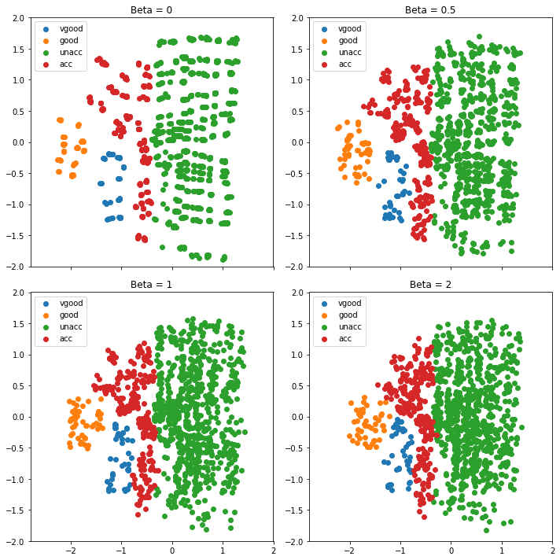

# Categorical-Vae
Implementation of VAE for multivariate categorical data

Uses library https://github.com/HIPS/autograd for computing gradients of VAE loss function.

I'm still updating the project.

Variational autoencoder is unsupervised method, that uses two neural networks (NN) for estimating probability distributions. If data is X (nxd) we can use VAE for finding P(X). First NN is called encoder and the second decoder. Encoder encodes X to a latent dimension z and decoder builds a reconstruction X_r from z. Distribution for z is usually assumed to be multivariate standard normal P(z)=N(mu,I) and encoder maps X to the parameters mu and I of Q(z|X)=N(mu,I). Distribution for reconstruction X_r is product of categorical distributions P(X_r|z)=Prod(Cat(p_i)), where i=1...d. Vae can be trained using mini-batch stochastic gradient descent and the loss function is E[log(P(X|z))] - D(Q(z|X)||P(z)), where D is Kullback-Leibler divergence. This implementation does not use sampling on the output layer of the decoder. Instead softmax output layer and cross entropy loss for each variable is used.

Vae is a versatile tool and it could be used in synthetic data generation, anomaly detection, missing data imputation Et cetera.

Example use:
```python
from Cat_vae.Vae_object import Vae
n,d = X_train.shape
T=500
q=0.09
s=0.01
layer_size=15
z_dim=2
encoder_layer_size=[d,layer_size,int(2*z_dim)] 
decoder_layer_size=[z_dim,layer_size,d]
vae_olio = Vae(encoder_layer_size,decoder_layer_size,var_size)
vae_olio.fit(X_train,T,q,s,beta=1,mcmc=2)
```

X_train should be numpy.ndarray in one-hot representation. Var_size should be a list containing number of possible events for each of the categorical variables in the training set. For Car-data [https://archive.ics.uci.edu/ml/datasets/car+evaluation], which I will be using as an example data, var_size is [4, 4, 4, 3, 3, 3, 4]. Car data contains 6 variables and one label with 4 possible values({'acc', 'good', 'unacc', 'vgood'}). 

T is the number of parameter updated, q is proportion of data points used in mini-batch SGD and s is the step size in mini-batch SGD. Layer size is the number of nodes in NN and z_dim is dimensionality of latent dimension. Beta and mcmc are optional and are by default one. Beta one corresponds original VAE. Beta controls importance of Kullback-Leibler divergence in loss function [https://openreview.net/references/pdf?id=Sy2fzU9gl] and mcmc is the number of mcmc samples used for calculation of E[log(P(X_r|z))].

VAE() creates a Vae object and initializes weights for boths NNs. Fit-method updates the weights with weights, that minimize the loss function. Vae object contains method compress, which can be used for encoding data to a latent dimension z. By varying beta we can see how smaller beta enables latent dimension distribution to differ from standard normal distribution. If one wants to use VAE for synthetic data generation beta should be one.

```python
z=vae_olio.compress(X_train)
```



Method sample creates a sample X_s from the estimated distribution. We could use X_s to fit a classification model and use it for predicting labels in the test set.

```python
from sklearn.linear_model import LogisticRegression
X_s=vae_olio.sample(n) # Z sample size equals training data sample size

clf = LogisticRegression(random_state=0, solver='lbfgs',multi_class='multinomial').fit(X_train[:,0:21], y_train)
clf_z = LogisticRegression(random_state=0, solver='lbfgs',multi_class='multinomial').fit(Z[:,0:21], z_train) # z_train should be vector containing the labels instead of one-hot matrix
print("Normal training set used, accuracy: "+str(clf.score(X_test[:,0:21],y_test)))
print("Synthetic training data used, accuracy: "+str(clf_z.score(X_test[:,0:21],y_test)))
Normal training set used, accuracy: 0.9176882661996497
Synthetic training used, accuracy: 0.8598949211908932
```

Based on this simple test synthetic data is somewhat usefull and conserves the structure of the original data! Perhaps by doing some hyperparameter tuning synthetic data quality could be improved. We could also inspect synthetic data quality visually by plotting the correlation matrices of both cases.


Synthetic data correlation matrix looks quite authentic although slightly too granural.
