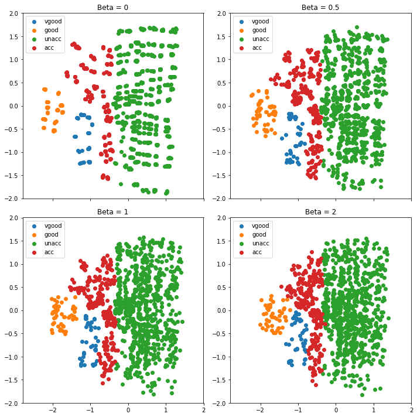

#Example use - fitting Vae-object and compressing data with encoder

VAE() creates a Vae object and initializes weights for boths NNs. Fit-method updates the weights with weights, that minimize the loss function. Vae object contains method compress, which can be used for encoding data to a latent dimension z. By varying beta we can see from the plot below, how smaller beta enables latent dimension distribution to differ from standard normal distribution. Encoder maps data points of the same class close to each other. If one wants to use VAE for synthetic data generation beta should be one. This is because we can create synthetic data by feeding the decoder data from multivariate normal distribution, since decoder is learned to map this kind of data.

```python
z=vae_olio.compress(X_train)
```


